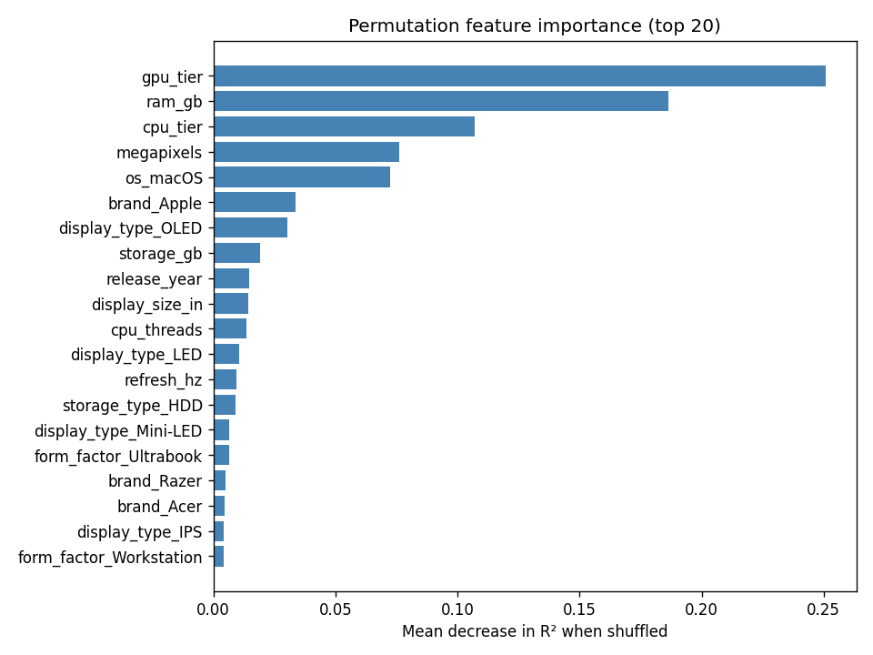

# 💻 Computer Price Estimator

**A machine-learning price estimator for laptops and desktops: pick the hardware specs, get a fair-price estimate with a confidence range and a breakdown of which specs drive the price.**

🔗 **Live demo:** _coming soon_ <!-- add your Streamlit Community Cloud / HF Spaces URL here -->

Useful for sanity-checking whether a listed price is fair, or pricing a used/custom build. Trained on 100,000 computer configurations (80,000 used for training, 20,000 held out for testing).

> ⚠️ Portfolio/educational project — estimates are not a professional valuation.

## Results

| Metric | Original notebook | This pipeline |
|---|---|---|
| Test R² | 0.833 | **0.880** |
| Test MAE | $164.92 | **$139.42** |
| Train R² (overfit check) | 0.935 | 0.870 |
| 90% prediction-interval coverage | — | 87.8% |

The headline "83% accuracy" of the original notebook was its **R² score on a held-out 20% test split** — an honest number (the one-hot encoder was fit inside a pipeline on training data only, so no target leakage). The improvement came from feature engineering, not a fancier trick:

- **Dropped the `model` column** — 99,036 unique marketing names across 100,000 rows, i.e. a row ID in disguise. One-hot encoding it added ~99k columns of pure memorization (the original's train R² of 0.935 vs test 0.833 was this overfitting). Removing it alone lifted plain linear regression from 0.833 to 0.873.
- **Reduced `cpu_model` (27k unique) to `cpu_family` (17 values)** — "Intel i5-11129" → "Intel i5". The numeric suffix is noise; tier/cores/clocks carry the real signal.
- **Parsed `resolution` into a numeric megapixel count** so the model sees the ordering (1080p < 1440p < 4K) instead of six unrelated categories.

### Algorithm comparison

| Algorithm | Test R² | Test MAE | Train R² | Fit time |
|---|---|---|---|---|
| **HistGradientBoosting** (winner) | **0.880** | **$139** | 0.870 | 5s |
| Ridge | 0.873 | $145 | 0.847 | <1s |
| Linear regression | 0.873 | $145 | 0.847 | <1s |
| Random forest | 0.848 | $159 | 0.975 | 13s |

Gradient boosting wins because the price has non-linear structure (tier × device-type interactions) that linear models can't capture, while its shallow-tree regularization avoids the random forest's memorization (note the forest's 0.975 train R² — heavy overfitting). Confidence ranges come from two extra gradient-boosting models trained with quantile loss (5th and 95th percentiles); their empirical coverage on the test set is 87.8% against the 90% nominal target.

### What drives the price?



GPU tier, RAM, and CPU tier dominate — with meaningful premiums for macOS/Apple, OLED displays, and higher-resolution panels. More charts in [`results/`](results/): actual-vs-predicted, residuals, and error-by-brand.

## Project structure

```
src/
  data_loader.py   # load + clean the dataset
  features.py      # SpecFeatureEncoder: fit-once encoding, reused at inference
  model.py         # PricePredictor: train/predict/save/load + confidence + explanations
  train.py         # CLI: compare algorithms, train, save artifacts + charts
app/app.py         # Streamlit demo app
tests/             # artifact loading, sane predictions, unseen-category handling
models/            # trained model.pkl + fitted encoders.pkl (both needed at inference)
results/           # metrics, comparison table, evaluation charts
notebooks/         # exploration notebook (imports from src/, no duplicated logic)
```

## How to run

```bash
python -m venv .venv && source .venv/bin/activate
pip install -r requirements.txt

# Train (compares algorithms, saves models/ + results/) — ~1 min
python -m src.train

# Launch the app
streamlit run app/app.py

# Tests
pytest tests/
```

## Robustness to unseen hardware

Real users will eventually pick a GPU or CPU that wasn't in the training data. The encoder uses `handle_unknown='ignore'`, so an unseen category encodes as all-zeros — the prediction falls back to what the numeric specs (tier, cores, VRAM, RAM…) imply instead of crashing. `SpecFeatureEncoder.unseen_categories()` reports exactly which values weren't seen, and the app constrains its dropdowns to known categories so invalid combinations can't be entered in the first place. This is covered by tests.

## What I'd improve with more time

- **Depreciation curve** — engineer `age = current_year − release_year` and interact it with tier, so the same spec sheet prices differently across years.
- **Neural-network baseline** — an embedding layer for categoricals + MLP, to check whether learned embeddings beat one-hot on this feature set.
- **Calibrated prediction intervals** — conformalize the quantile models so the 90% interval empirically covers 90% (currently 87.8%).
- **SHAP explanations** — replace the swap-one-spec-group attribution with SHAP values for exact, additive breakdowns.
- **Real market data** — the dataset is synthetic/curated; scraping real listings would add messiness (missing values, condition, seller effects) worth modeling.
